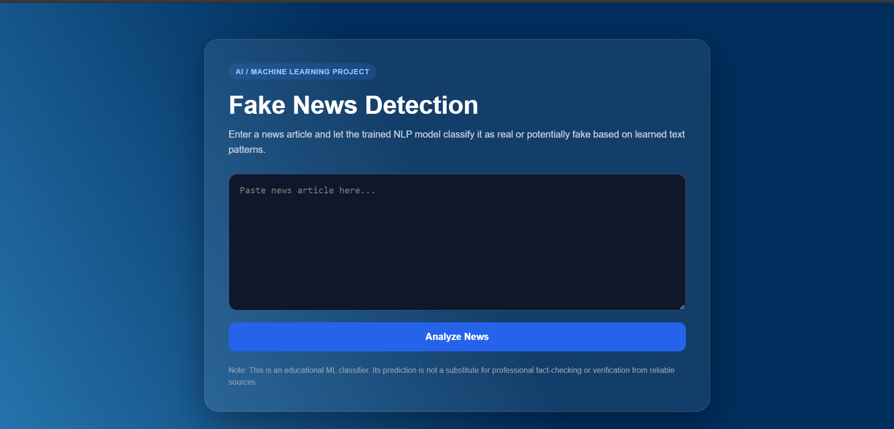
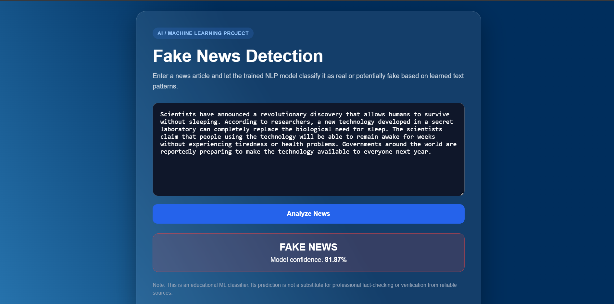

# Fake News Detection

A Machine Learning based Fake News Detection web application built using **Python, NLP, Scikit-learn, TF-IDF, Logistic Regression, and Flask**.

The system analyzes the text of a news article and classifies it as **Real News** or **Fake News** based on patterns learned from a labeled dataset.

---

## Features

📰 News article text input
🧹 Text preprocessing
🔤 TF-IDF feature extraction
🤖 Logistic Regression Machine Learning model
✅ Real News / Fake News classification
📊 Prediction confidence score
🌐 Flask web application
📈 Model evaluation using Accuracy, Precision, Recall and F1-Score
🔄 Easy model retraining with a custom dataset
📱 Responsive and user-friendly interface

---
##  Screenshots

### Home Page



---

### Fake News Detection Result


## Technologies Used

### Programming Language
Python

### Machine Learning & NLP
Scikit-learn
Pandas
TF-IDF Vectorization
Logistic Regression

### Web Development
Flask
HTML5
CSS3

### Tools
Git
GitHub
VS Code

---

##  Machine Learning Workflow

```text
News Article
     ↓
Text Preprocessing
     ↓
Combine Title + Article
     ↓
TF-IDF Vectorization
     ↓
Train/Test Split
     ↓
Logistic Regression
     ↓
Model Evaluation
     ↓
REAL NEWS / FAKE NEWS